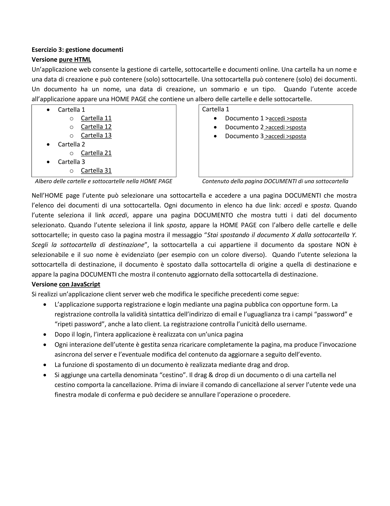

# Descrizione
Questa repository contiene un sito web sviluppato da me molto semplice e poco utile dal punto di vista funzionale, ma che mi è stato assegnato come esame per testare le mie conoscenze di utilizzo di HTML,CSS,JavaScript e di Java (beans,servlets,ecc...). Il sito è stato prodotto in due versioni:

* Versione Pure HTML (Thin client) --> La computazione delle pagine dinamiche avviene solo lato server
* Versione RIA (Fat client) --> La computazione si suddivide tra server e client e il client utilizza degli script di JS per effettuare dei refresh localizzati della pagina ed 								effetturare delle richieste asincrone al server

# Contenuto

* PoliDoc folder   : contiene la versione Pure HTML del progetto
* PoliDocCS folder : contiene la versione RIA del progetto
* pureHTML.pptx    : è la presentazione del progetto Pure HTML
* RIA.pptx         : è la presentazione del progetto RIA

# Software usati

* Apache Tomcat 9.0.34
* MySQL
* Eclipse
* Librerie: Thymeleaf, javax, mysql-connector-java, gson e quelli integrati in tomcat

# Come utilizzare i progetti

* Installare Eclipse, MySQL e Tomcat e configurare tomcat in eclipse
* Creare lo schema nel database usando i dump nella cartella WebContent nei rispettivi progetti
* Importare i progetti in eclipse e sistemare nel Build Path del progetto le varie dipendenze, inserendo le librerie richieste soprattutto quelle di tomcat
* Nel descrittore web.xml di ogni progetto impostare i context parameters dbUrl, dbUser, dbPassword, dbDriver in modo da permettere la comunicazione con il database in MySQL

# Esercizio Assegnato

